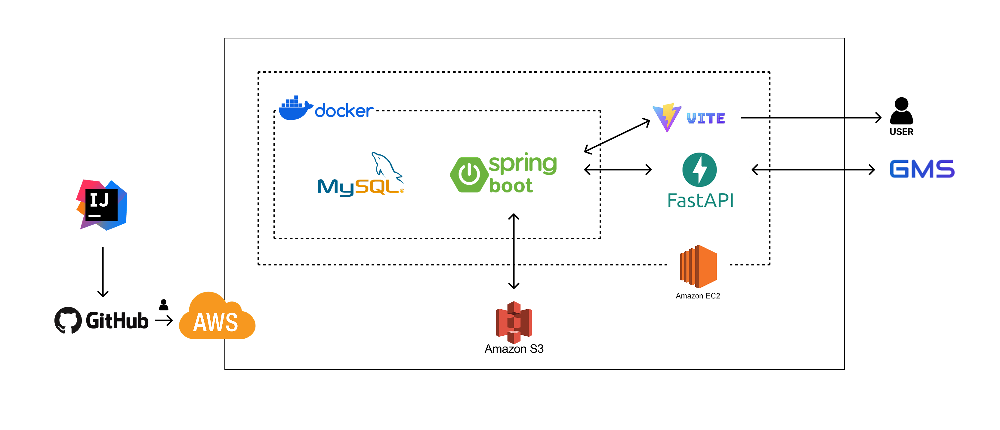
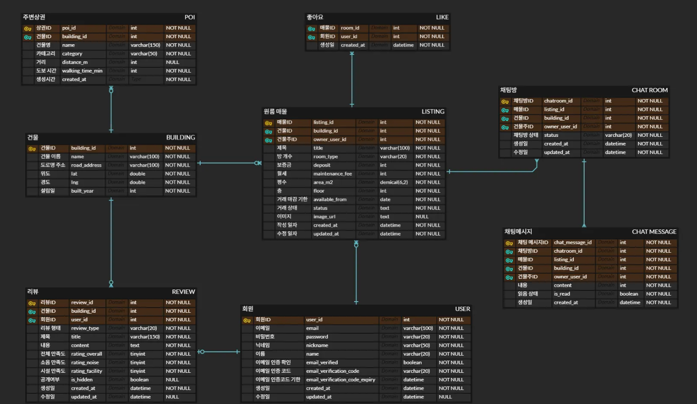

# ZIP-Chack Backend

**꼼꼼하게 따져보는 원룸 리뷰 & 정보 플랫폼, ZIP-CHACK**

ZIP-Chack 백엔드는 실거주자 리뷰 기반 원룸 정보 플랫폼의 REST API 서버입니다. Spring Boot를 기반으로 구현되었으며, 카카오맵 API 연동을 통한 지도 기반 검색과 WebSocket을 이용한 실시간 채팅, 그리고 Python AI 서버와 연동된 상권 분석 기능을 제공합니다.

---

## 🏛️ 시스템 아키텍처 (System Architecture)



*   **Frontend**: Vue.js + Vite
*   **Backend**: Spring Boot 3.x
*   **Database**: MySQL 8.0
*   **AI Server**: Python FastAPI - 상권 분석 및 챗봇

---

## 📊 데이터베이스 설계 (ERD)



---

## 🛠 기술 스택

- **Language:** Java 17
- **Framework:** Spring Boot 3.5.9
- **Database:** MySQL 8.0
- **ORM:** Spring Data JPA
- **Security:** Spring Security (JWT, CORS)
- **Communication:** Spring WebFlux (WebClient), WebSocket (STOMP)
- **Documentation:** Swagger (SpringDoc OpenAPI 2.8.3)
- **External:** Kakao Map API, AWS S3, OpenAI API (via AI Server)

---

## 📖 API 명세서 (Swagger)

서버 실행 후 아래 주소에서 전체 API 명세 확인 및 테스트가 가능합니다.

*   **접속 주소:** [http://localhost:8080/swagger-ui/index.html](http://localhost:8080/swagger-ui/index.html)

> **🔐 인증 테스트 가이드**
> 1. `Auth API`에서 로그인 후 응답 값의 `accessToken`을 복사합니다.
> 2. Swagger 우측 상단의 **Authorize** 버튼을 클릭합니다.
> 3. `Bearer {복사한_토큰}` 형식으로 입력하고 **Authorize**를 누릅니다. (예: `Bearer eyJ...`)

---

## 🚀 실행 방법

### 사전 요구사항
- Java 17+
- Maven 3.6+
- MySQL 8.0 (Schema: `zip_chack`)

### 로컬 실행
```bash
# 1. 프로젝트 클론 및 이동
cd ZIPCHACK-BE

# 2. 의존성 설치 및 실행
./mvnw clean spring-boot:run
```

### 환경 변수 설정 (.env)
프로젝트 루트에 `.env` 파일을 생성하여 민감한 정보를 관리합니다.

```env
# Server
SERVER_PORT=8080

# Database
DB_URL=jdbc:mysql://localhost:3307/zip_chack?useSSL=false&serverTimezone=Asia/Seoul
DB_USERNAME=root
DB_PASSWORD=your_password

# Kakao Map
KAKAO_MAP_REST_API_KEY=your_kakao_rest_key

# Mail (Gmail SMTP)
MAIL_USERNAME=your_email@gmail.com
MAIL_PASSWORD=your_app_password
```

---

## 📄 라이선스
SSAFY 관통 프로젝트 - ZIP-Chack Team